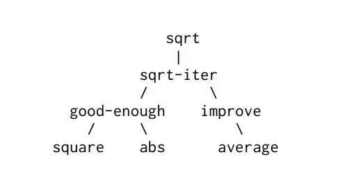

## Procedures as Black-Box Abstractions.

`sqrt` is our first example of a process defined by a sen of mutually definded prcedures. Notice that the definition of `sqrt-iter` is *recursive*; that is, the procedure is defined in terms of itself. The idea of being able to define a procedure in terms of itself my be disturbing; in may seem unclear how such a "circular" definition coud make sence at all, much less specify a well-defined process to be carried out by a computer. This will be addressed more carefully in **Section 1.2.**. But first let's consider some other important points illustrated by the `sqrt` example.



#### Figure 1.2: Procedural decomposition of the sqrt program.

Observer that the proglem of computing square roots breaks up naturally into a number of subproblems: how to tell wheter a guess is good enought, how to improve a guess, and so on. Each of these tasks is accomplished by a separate procedure. The tntire `sqrt` program can be viewed as a cluster of procetures (show in **Figure 1.2**) that mirror the decompostion of the proglem into subproblems.

The importance of this decomposition strategy is not simply that one si dividing the program into parts. After all, we could take any large program and divide it into parts - te first ten lines, the next ten lines, then next ten lines, ans so on. Rather, it is crucial that each procedure accomplishes an identifiable task that can be used as module in defining other procedures. For example, when we define the `good-ehough?` procedure in terms of `square`, we able to regard the `square` procedure as a "black box". We are not at that momen concerned with *how* the procedure computes its result, only with the fact that it computes the square. The details of how the square is computed can e suppressed, to be considered at a latter time. Indeed, as far as the `good-enought?` procedure is concerned, `square` is not quite a procedure but rather an abstraction of a procedure, a so-called *precedureal abastraction*. At this level of abstraction, any procedure that computes the square is equally good.

This, considering only the values thay return, the following two procedures for squaring a number should be indistinguishable. Each takes a numberical argument and produces the square for that numbe as the value *25*.

> *(25)* It is not even clear which of these procedures is a more efficient implementation. This depends upon the hardware available. There are machines for which the "obvious" implementation is the less efficent one. Consider a machine that has extensive tables of logarithms and antilogarithms stored in a very efficeint manner.

```Lisp
(define (square x) (* x x))
(define (square x)(exp (double (log x))))
(define (double x) (+ x x))
```

So a pocudure definition shuold be able to suppress detail. The useds of the procedure man not have written the procedure themselves, but may have obtained it from anogher programmer as a black box. A user shuold no need  to know how the procedure is implemented in order ot use it.

### Local names

One detail of procedure's implementation that should not matter to the uer of the proceure is the implementer's choice of names for the procedure's fromal parameters. Thus, the following procedures should not be distinguishable.

This principle - that the meaning of a procedure should be indepented of the parametsr names used by its author - seems on the surface to be self-evident, but its consequences are profound. The simplest consequence is that the parameter names of a procedure must be local to the body of the procedure. For example, we used `square` in the definition of `good-enough?` in our square-root procedure:

```Lisp
(define (good-enough? guess x)
(< (abs (- (square guess) x)) 0.001)
)
```

The intention of the author of `good-enough?` is to determine if the square of the first argument is within a given tlerance of the secon argument. We see that the author of `good-enough?` used the name `guess` to refer to the first argument and `x` to refer to the second argument. The argumen of `square` is `guess`. If the author of `square` used x (as abouve) to refer to that argument, we see that x in `good-enough?` must be differnt `x` th one in `square`. Running the prcdeure `square` must not affect the value of `x` that is used by `good-enough?`, because that value of `x` may be need by `good-enough?` after square is done computing.

If the parameters were not local to the bodies of their repsecitve procedures, than the parameter `x` in `square` coud be confused with the parameter `x` in `good-enough?`, and the bahaviou of `good-ehough?` would depend upon which verion of `square` we used. Thus, `square` would not be the balck box we desired.

A formal parameter of a procedure has a very special role in the procedure definition, in that it doesn't matter what name the formal parameter has. Such a name is called a *bound variable*, and we say that the procedure definition *binds* its formal parameters. The meaning of a procedure definition is unchenged if a bound variable if consistently renamed throughout the definition *26*. If a variable is not bound, we say it is *free*. The set of experessions for which a binding defines a name is called the *scope* of than name. In a procedure definition, the bound variables as the fromal parameters of the proceduree have the body of the procedure as their scope.


